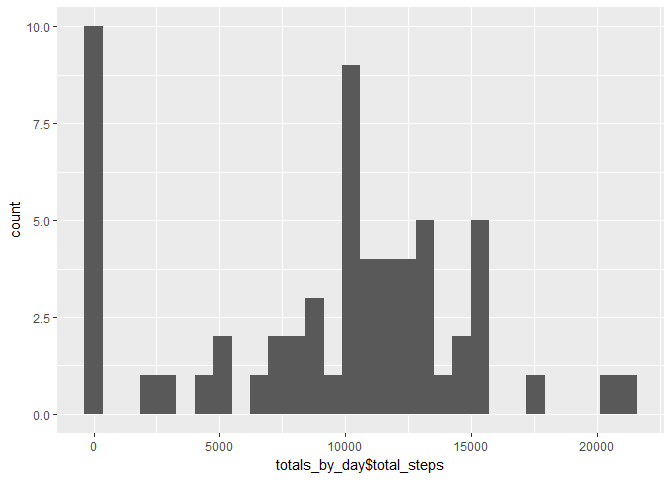
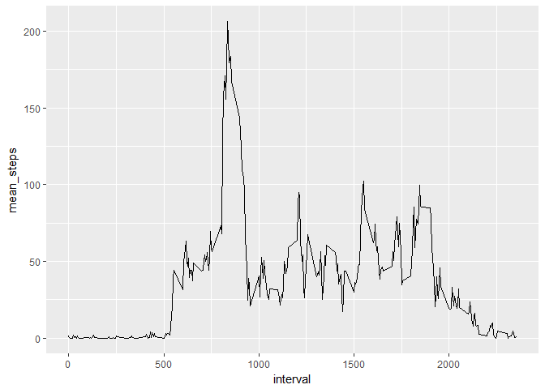
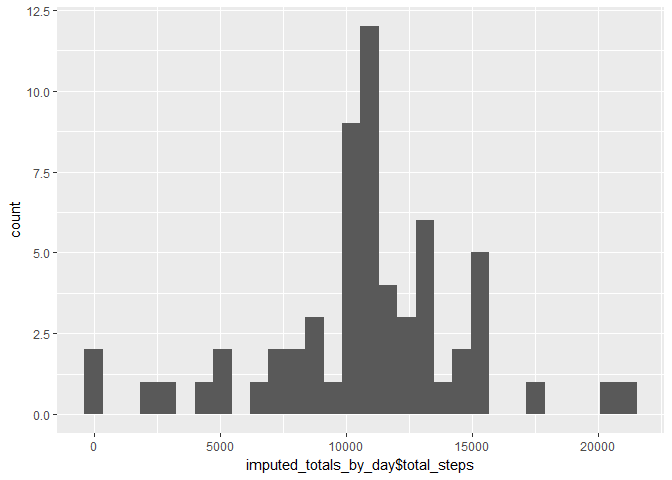
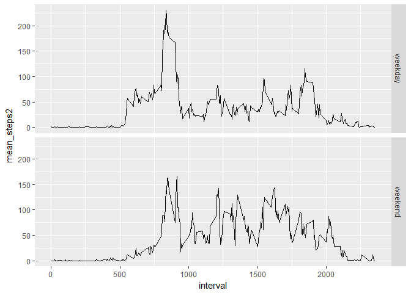

## Loading and preprocessing the data


```r
## Downloading and unzip raw data
if(!file.exists("./Project1_data")){dir.create("./Project1_data")}
fileUrl <- "https://d396qusza40orc.cloudfront.net/repdata%2Fdata%2Factivity.zip"
download.file(fileUrl, destfile = "./Project1_data/raw.zip")
unzip(zipfile="./Project1_data/raw.zip")

## Read data and initiate necessary packages
library(dplyr)
```

```
## 
## Attaching package: 'dplyr'
```

```
## The following objects are masked from 'package:stats':
## 
##     filter, lag
```

```
## The following objects are masked from 'package:base':
## 
##     intersect, setdiff, setequal, union
```

```r
library(ggplot2)
data <- read.csv("activity.csv")
```


## What is mean total number of steps taken per day?


```r
## Make a histogram of the total number of steps taken each day
totals_by_day <- data %>% 
    group_by(date) %>%
    summarise(total_steps = sum(steps, na.rm = TRUE))

qplot(totals_by_day$total_steps)
```

```
## `stat_bin()` using `bins = 30`. Pick better value with `binwidth`.
```

<!-- -->

```r
##Calculate and report the mean and median total number of steps taken per day

    ###This reports mean
    round(summary(totals_by_day$total_steps)[4], 0)
```

```
## Mean 
## 9354
```

```r
    ###This reports median
    summary(totals_by_day$total_steps)[3]
```

```
## Median 
##  10395
```

## What is the average daily activity pattern?


```r
stats_by_day <- data %>% 
    group_by(interval) %>%
    summarise(mean_steps = mean(steps, na.rm = TRUE))
    
ggplot(data = stats_by_day, aes(x = interval, mean_steps)) + geom_line()
```

<!-- -->

```r
## Report the interval with largest mean steps

stats_by_day[[which.max(stats_by_day$mean_steps),2]]
```

```
## [1] 206.1698
```


## Imputing missing values


```r
## Calculate and report the total number of missing values in the dataset (i.e. the total number of rows with NAs)

## Total number of missing values (# rows with NAs)
sum(is.na(data$steps))
```

```
## [1] 2304
```

```r
## Impute NAs in dataset with the means of steps by 5-minute interval

m <- merge(data, stats_by_day)
m[is.na(m)] <- m[is.na(m$steps),][,4]

## Make a new histogram of the total number of steps taken each day using the imputed data
imputed_totals_by_day <- m %>% 
    group_by(date) %>%
    summarise(total_steps = sum(steps, na.rm = TRUE))

qplot(imputed_totals_by_day$total_steps)
```

```
## `stat_bin()` using `bins = 30`. Pick better value with `binwidth`.
```

<!-- -->

```r
## Calculate and report the mean and median total number of steps taken per day

###This reports mean
round(summary(imputed_totals_by_day$total_steps)[4], 0)
```

```
##  Mean 
## 10766
```

```r
###This reports median
summary(imputed_totals_by_day$total_steps)[3]
```

```
##   Median 
## 10766.19
```

```r
###Conclusion: Both the mean and median have increased. The totals of daily steps increase overall.
```

## Are there differences in activity patterns between weekdays and weekends?


```r
##Creating weekday variables in the imputed dataset
m$day <- weekdays(as.Date(m$date))
    
f <- function(x){
        if (x %in% c("Saturday", "Sunday")) return("weekend")
        else if (x %in% c("Monday", "Tuesday", "Wednesday", "Thursday", "Friday")) return("weekday")
}

weekday_or_weekend <- data.frame(w = sapply(m$day, FUN = f))[,1]

m$weekday_or_weekend <- weekday_or_weekend

##Generate plot for weekend and weekday

stats_by_day_with_dayname <- m %>% 
    group_by(interval, weekday_or_weekend) %>%
    summarise(mean_steps2 = mean(steps, na.rm = TRUE))


ggplot(data = stats_by_day_with_dayname, aes(x = interval, y= mean_steps2)) + geom_line() + facet_grid(weekday_or_weekend ~ .)
```

<!-- -->
